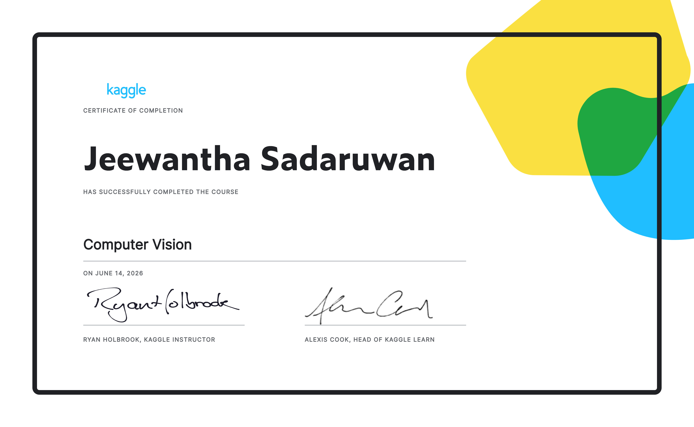

# Kaggle Computer Vision Course — Notes

Personal learning notes and TensorFlow/Keras implementations from the [Kaggle Computer Vision course](https://www.kaggle.com/learn/computer-vision).

---

## Certificate

---

## Course Notes

| Notebook | Topic |
|----------|-------|
| [note1.ipynb](note/note1.ipynb) | The Convolutional Classifier — CNN architecture, pretrained models, transfer learning basics |
| [note2.ipynb](note/note2.ipynb) | Convolution and ReLU — kernels, feature maps, sliding window, filter and detect steps |
| [note3.ipynb](note/note3.ipynb) | Maximum Pooling — condensing feature maps, translation invariance, GlobalAvgPool2D |
| [note4.ipynb](note/note4.ipynb) | The Sliding Window — stride, padding (valid vs same), receptive field |
| [note5.ipynb](note/note5.ipynb) | Custom Convnets — building a CNN from scratch, convolutional blocks, training from scratch |
| [note6.ipynb](note/note6.ipynb) | Data Augmentation — RandomFlip, RandomContrast, transfer learning with VGG16 |

---

## Key Concepts Covered

- Convolutional base and dense head architecture
- Feature extraction: filter (Conv2D), detect (ReLU), condense (MaxPool2D)
- Kernels, feature maps, and the sliding window
- Stride and padding effects on output size
- Receptive field and why stacking 3x3 layers is efficient
- GlobalAveragePooling2D as an alternative to Flatten
- Translation invariance through max pooling
- Training a custom CNN from scratch vs transfer learning
- Data augmentation using Keras preprocessing layers
- Training curve analysis and overfitting detection

---

## Stack

- Python 3.13
- TensorFlow / Keras
- NumPy, Matplotlib, SciPy
